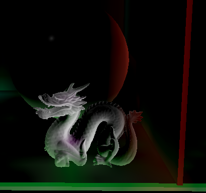
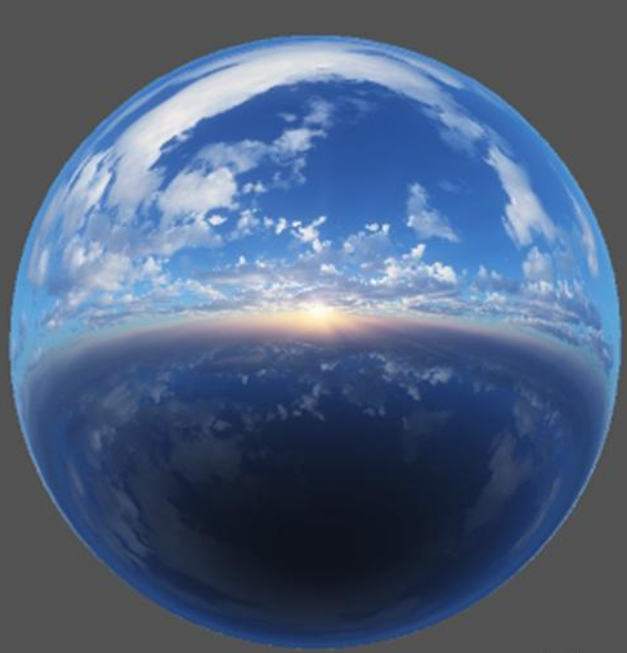
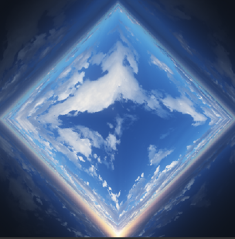
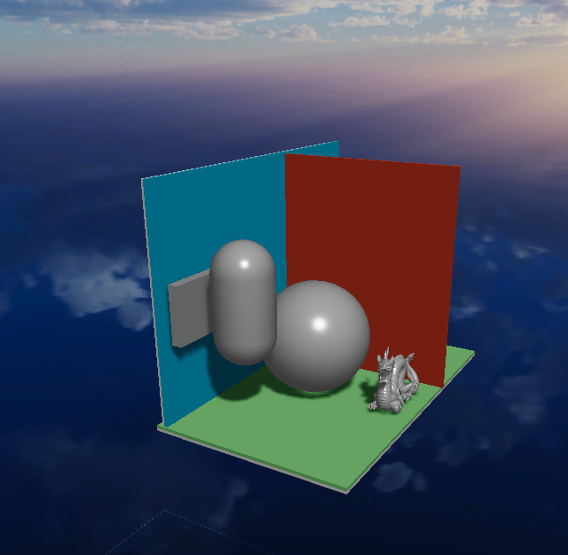
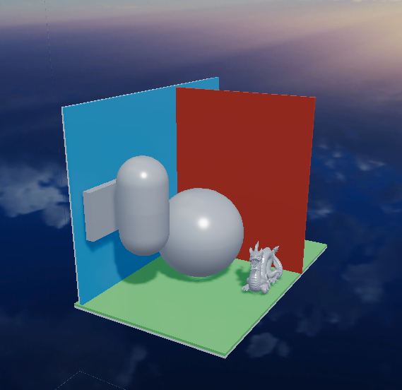
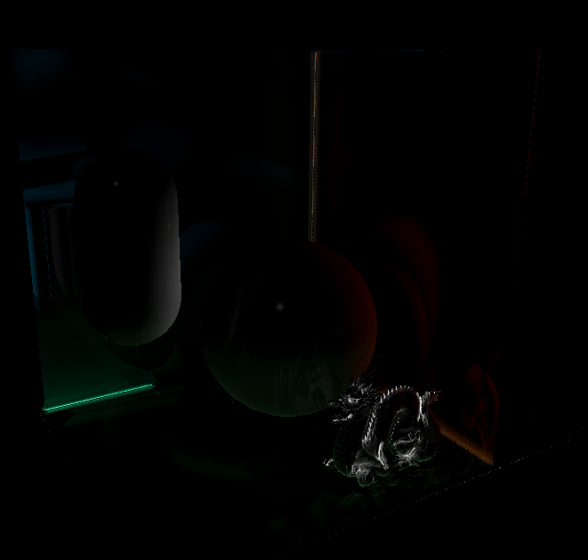
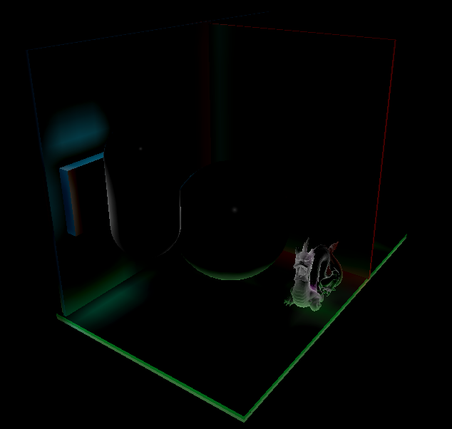
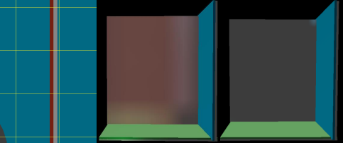

# FzbSRP

## 项目简介

本项目基于[catlike 的 SRP 教程](https://catlikecoding.com/unity/tutorials/custom-srp/)
目前实现的功能有

- **catlike 教程内容**
  - 前向渲染
  - CSM
  - Baked Light
  - LOD
  - 后处理
  - 粒子系统
  - FXAA
- **[SSAO](https://learnopengl-cn.github.io/05%20Advanced%20Lighting/09%20SSAO/)**
- **[HBAO](https://developer.download.nvidia.com/presentations/2008/SIGGRAPH/HBAO_SIG08b.pdf)**
- **环境映射**
  - 八面体映射
  - 抛物线映射
  - [同心圆映射](https://zhuanlan.zhihu.com/p/7966597051)
  

    
    
  

- **[IBL]()**
  

    
    
  

- **[RSM](https://dl.acm.org/doi/10.1145/1053427.1053460)**
  
- **[LPV](https://dl.acm.org/doi/10.1145/1730804.1730821)**
  
- **SSLPV**：本科毕业论文，使用切比雪夫不等式缓解 LPV 由于离散结构复用球谐函数导致的漏光。
  
  左图为平面在体素网格的情况；中间为 LPV；右边为 SSLPV。
  
  
